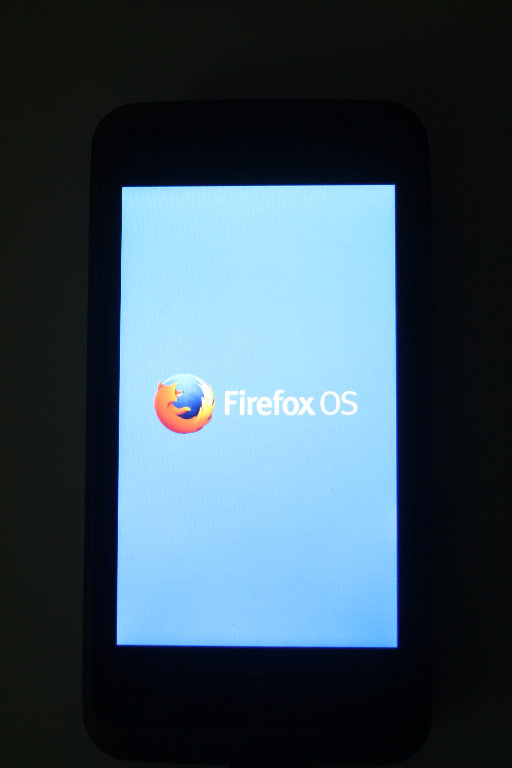
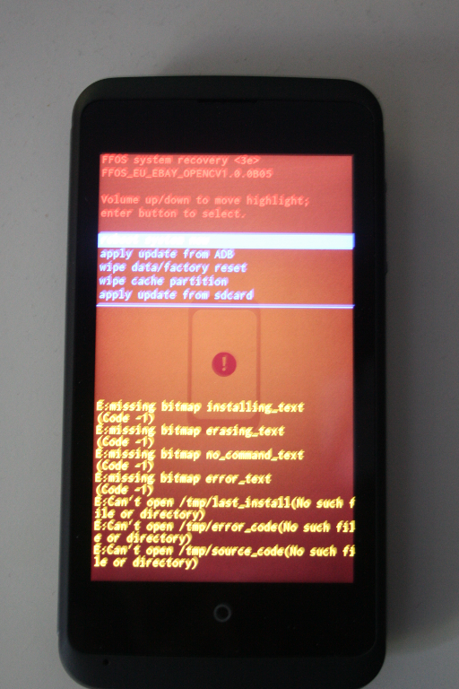

# ZTE Open C Unbrick and Root-Kit

This kit allows unbricking the device, even if no system partition was found.
The only requirement for it to work is having a fastboot bootloader.
You don't need a working recovery mod in order to unbrick the device.


# Usage


## Setup and Preparation


You need a Ubuntu host machine in order to use this kit. I use Ubuntu 14.04 Trusty Thar, because the ADB is easier to install there.

Install ADB and fastboot via:

```bash
sudo apt-get update;
sudo apt-get install android-tools-adb android-tools-fastboot;
```


## Fastboot Mode


Enter Fastboot Mode by pressing **Power + Volume Down** for around 5-10 seconds.
Power on the device whilst pressing these buttons.

There's no visual feedback on entering fastboot as it's showing the Firefox OS logo which will look like this:




You can confirm that fastboot is up and running via:

```bash
christoph@blackbox:~/Software/zte-openc-rootkit$ fastboot devices
9a19590fastboot
```

If you don't see the results, go back to the Setup section or file an issue.


## Recovery Mode


Enter Recovery Mod by pressing **Power + Volume Up** for around 5 seconds.
Power on the device whilst pressing these buttons.

After a couple seconds, you will see an orange-backgrounded RecoveryMod which will look like this:




Navigate through the menu using the Volume buttons.
Execute/Open an item via Power button.


# Unbrick Guide


In case you completely bricked the device, you have to follow this guide in order to unbrick it.

Boot the device in fastboot mode. After being in fastboot mode, execute the following:

```bash
cd ./01-unbrick;
./01-unbrick.sh;
```

The device will now boot into recovery mode (after around 3 seconds), now select the menu item *Apply update from ADB*.
When the sideload message appears, execute the following:

```bash
cd ./01-unbrick;
./02-install.sh;
```

This will take a while. After the installation process is finished, you can reboot the device.
The device has now the OEM FirefoxOS system installed. You can now root the device with the Root Guide.


# Root Guide


Rooting is currently only temporarily possible as there's no signed *update.zip* file with a rooted kernel inside.
Self-signed *update.zip* files can't be flashed using the preinstalled 3E recovery mod.

The preinstalled fastboot can't flash boot partition, neither does the flash_image binary work properly.
But, you can install su, daemonsu and chattr in a temporary booted session.

ADB can't be rooted for now, because it requires **ro.secure=0** and **ro.debuggable=1** inside the */default.prop*,
which lies inside the boot.img.


Boot the device in fastboot mode. After being in fastboot mode, execute the following:

```bash
cd ./02-root;
./01-boot.sh;
```

After the OS has booted properly, you can install the required su-binaries on the system via:

```bash
cd ./02-root;
./02-install.sh;
```


# TWRP Guide

TWRP is currently being ported by me, so it needs some time until it is ready.
If you want to offer help, please write to the b2g-dev mailing list.


# Custom update.zip Guide

Custom update.zip files need a working TWRP or CWM recovery mod. The issue here is that fastboot can't flash system.img
files directly due to its 256MB filesize limit on the device implementation.


# LICENSE


The update.zip is copyrighted by ZTE Corporation.
My modifications are released under WTFPL.

